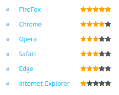

# Test Project

### Description
This is a simple one-page website. Please see simple_website.png in folder to see how the page should look. In script.js there is some data to apply to page.

Below are tasks to perform.

### Tasks to perform
1. Please add styles to replicate page layout inline with simple_website.png
2. Add the sample logo image from styles folder to the page appropriately and link to index.html

### Without editing html do the following:
3. Using data from script.js, update the page to include all browsers from data. Display in descending order based on rating.
4. Add 'current' class to only the lastly clicked item and display related browser information message as shown.
5. Add 'clicked' class to clicked list items. When all items are clicked display complete message as shown.
6. Display star ratings beside each browser as shown. You can use included font-awesome library for star with classes 'fa fa-star'

Note: 'clicked','current', and 'checked'(for star) classes are already included in style.css.

---

# Notes from Herman

As it was requested, I haven't edited the HTML for the tasks **2 to 6**. But as it wasn't a requirement for the tasks number **1 and 2**, all the changes that you'll find in the HTML file are for those two items only.

## Browser list text displayed in blue

In the mockup image `simple_website.png`, the text in the browser list is displayed in dark red because it assumes that all the items have been already clicked. But when the webpage is loaded for the first time, those items must be displayed in a **different color** (otherwise the user couldn't tell what item was already clicked). As the original CSS had that color set in blue, I left it **blue**, as shown in the image below:

### Link:
[You can see the webpage working by clicking in this link](http://coolansplanet.com/public/static/simple_test/index.html)
